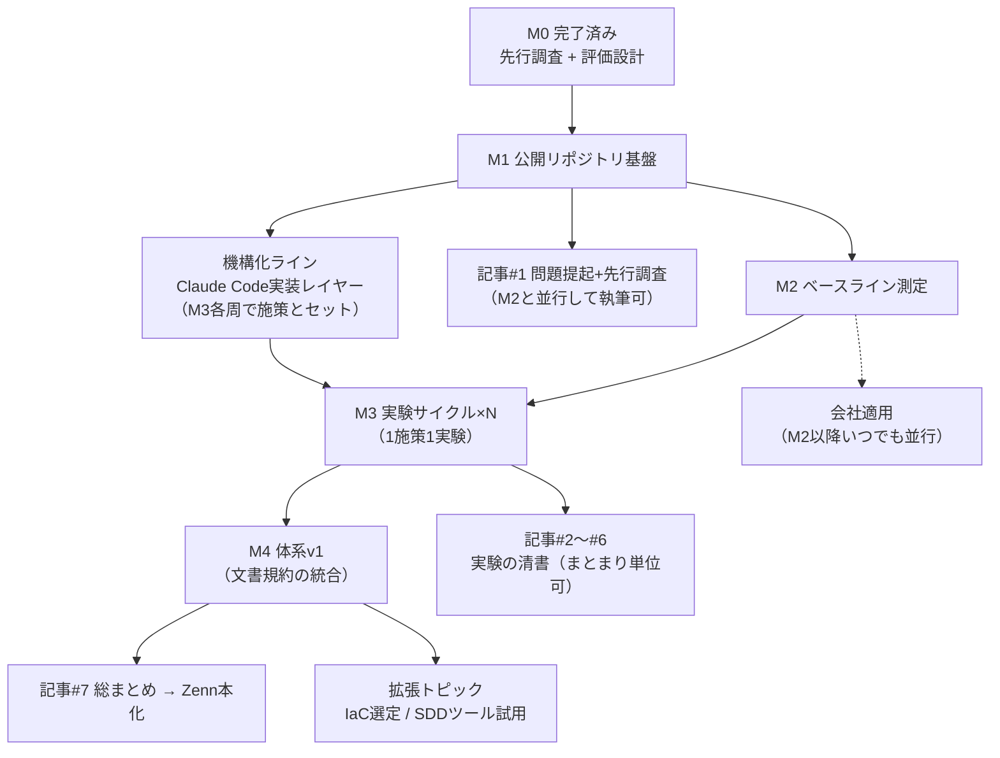

# 研究ロードマップ v1.0 — AI駆動開発時代のドキュメント論

- 作成日: 2026-08-25
- 最終ゴール: (a) 研究結果を記事シリーズとして投稿し（Zenn を正典、反響の大きいものを Qiita にも展開）、転職活動のポートフォリオにする。(b) 成果を実務（現PJ の AWS 設計書まわり）で使う。研究リポジトリ自体も GitHub で公開する。
- 管理方式: 期限は切らず、**マイルストーン（達成条件）型**で管理する。順番と依存関係だけを固定し、各マイルストーンは「達成条件を満たしたら完了」。

## 0. 進め方の3原則

**研究プロセス自体を成果物にする。** このプロジェクトの転職市場での価値は「良いテンプレートを作った」ことではなく、「課題設定 → 先行調査 → 仮説 → 実験 → 数値で効果検証」というプロセスを個人で回しきったことにある。だから実験ログ（仮説/介入/前後の数値/結論）を必ず残す。失敗した施策の記録も記事のネタとして成功と同価値。

**実験を記事のネタ元にする。** 記事のネタ切れを構造的に防ぐため、記事は実験サイクルから書く。ただし1実験1記事の対応は強制せず、複数の実験をまとめて1本にしてよい（2026-08-26 改訂。当初は「1実験 = 1記事」だった）。記事は実験の「清書」であって別作業ではない。

**公開と業務の分離。** リポジトリを公開する以上、会社由来の情報（社名・実構成・実パラメータ・議事録内容）は一切入れない。公開実験は**架空の題材（自作のサンプル AWS 構成）**で行い、業務にはその知見を私的に適用する。この分離規律は先行調査 §9 の「秘匿情報と資料の境界」の実践でもある。

## 1. 全体像



## 2. マイルストーン定義

### M0: 先行調査と評価設計（完了済み・2026-08-25）

成果物は `research/` の先行調査レポートと評価設計 v0.1。記事#1 の素材はすでに揃っている。

### M1: 公開リポジトリ基盤

研究を「動く成果物」として見せる器を作る。GitHub に公開リポジトリを作成し、次の構成を置く。

```
ai-docs-lab/                  ← リポジトリ名は要検討（例）
├── README.md                 ← 研究の目的・全体像・成果への案内（ポートフォリオの顔）
├── canon.md                  ← 正典の階層の定義（事実=IaC / 決定=ADR / 意図=spec / 議事録=ソース）
├── glossary.md               ← グロッサリ（用語・定義・言い換え禁止語）
├── conventions/              ← 規約群（出典規約、Mermaid規約、フォーマット規約）
├── templates/                ← 文書テンプレート（AWS設計書2層テンプレ、ADR、実験ログ等）
├── research/                 ← 調査レポート（既存2本を移す）
├── experiments/              ← 実験ログ（連番・追記型）
├── harness/                  ← 評価ハーネス（ゴールデンQA、採点手順、後にスクリプト）
└── sample-project/           ← 実験用の架空AWS構成（CFnテンプレート+資料一式）
```

このリポジトリには Claude Code の機構ディレクトリ（`.claude/` の rules / skills / agents / hooks、`.mcp.json`、CI ワークフロー）も含める。詳細は `research/` の「Claude Code 実装レイヤー設計」を参照。

達成条件: リポジトリが公開され、README・canon.md・出典規約・実験ログテンプレ・架空サンプル PJ の初版（小さくてよい。例: S3 + CloudFront + Lambda + DynamoDB 程度の構成と、その設計書 v1）に加え、機構の骨格（薄い CLAUDE.md、rules の器、秘匿情報ブロックフック、.mcp.json の AWS Knowledge MCP 接続）が揃っている。**サンプル PJ の設計書 v1 は「今のあなたの書き方」で書く**——これが実験の統制群（ビフォー）になる。

### M2: ベースライン測定

評価設計 v0.1 の最小構成を実行する。サンプル PJ の設計書からゴールデン QA 20問を作り、AI に資料だけで回答させて採点（正答率・根拠の資料内存在）。静的カウント3つ（変更波及率・出典カバレッジ・トークンサイズ）を手数えで記録。結果を `experiments/000_baseline.md` に記録する。

達成条件: ベースラインの数値が experiments/ に記録されている。これで以後のすべての施策が「前後比較」で語れるようになる。

### M3: 実験サイクル ×N（このプロジェクトの本体）

1周 = 「施策を1つ導入 → **対応する enforcement 機構（rules / skill / subagent / hook）を実装** → ハーネスで測定 → 実験ログ記録」。記事化は実験のまとまり単位でよい（§0）。規約と機構は必ずセットで入れる（「規約は機構が守らせる」原則）。導入順は効果の独立性と手軽さから次を推奨するが、各周の終わりに見直してよい。

| 周 | 施策 | セットで実装する機構 | 主な測定 | 対応記事（目安） |
|---|---|---|---|---|
| 1 | グロッサリ導入 | textlint+用語照合の PostToolUse フック | QA正答率、用語揺れ数 | 記事#2 |
| 2 | 出典規約（text fragment + AWS Knowledge MCP） | citation-verifier subagent、出典チェックフック | 出典カバレッジ、出典照合合格率 | 記事#3 |
| 3 | AWS設計書2層テンプレート（共通判断層+リソース固有層） | /new-design-doc skill + design-doc rules | QA正答率、トークン量、波及率 | 記事#4 |
| 4 | 未決/確定管理（ADR + Open Questions 集約） | /new-adr・/minutes-to-adr skills + adr rules | 未決滞留、正典違反数 | 記事#5 |
| 5 | AI矛盾検出ワークフロー | consistency-checker subagent + CI（claude -p 回帰） | 矛盾注入テストの検出率 | 記事#5 or #6 |
| 6 | 作成過程の設計（Issue 粒度・spec 先行の A/B。2026-08-26 追記、§8） | Issue テンプレート + authoring-process 規約 | 同一題材 A/B: QA正答率、作成時間、手戻り数 | 追加1本（§8） |

達成条件（周ごと）: 実験ログが前後の数値つきで記録されている。達成条件（M3全体）: 3周以上完了。

### M4: 体系v1（統合）

実験で効果が確認できた施策だけを、1つの文書規約セット「体系v1」に統合する（conventions/ と templates/ の整理、文書型カタログ、Mermaid 記法規約を含む）。効果がなかった施策は「不採用と理由」を明記して残す——これが研究としての誠実さであり、記事の説得力になる。

達成条件: 第三者（または AI）が体系v1 だけを読んで新しい資料を書き始められる状態。

## 3. 発信ライン（Zenn 正典 + Qiita 展開）

記事シリーズの構成案。Zenn に連載として置き、M4 完了後に Zenn 本（book）形式に再編する。反響（いいね・閲覧）が大きかった回を Qiita に再構成して展開し、両プラットフォームからリポジトリへリンクする。

1. **#1 問題提起 + 先行調査**: 「AI駆動開発では実装よりドキュメントがボトルネックになる」——8つの問題意識と既存手法のマッピング。素材は調査レポートに揃っており、**M2 と並行して今すぐ書き始められる**。
2. **#2 ドキュメントをユニットテストする**: ゴールデンQA によるベースライン測定とグロッサリ実験。「資料の品質を AI への Q&A で測る」はまだ確立された名前のない領域で、**シリーズ中で最も差別化になる1本**。
3. **#3 AI に嘘をつかせない出典設計**: text fragment ディープリンク + AWS Knowledge MCP + 出典照合。
4. **#4 AWS リソース設計書テンプレート**: 実務直結で検索需要が最も見込める回。
5. **#5 未決事項と議事録の正典問題**: ADR 運用と矛盾検出。
6. **#6 Claude Code で資料体系を機構化する**: rules / skills / subagents / hooks / CI の実践。Claude Code 実践記事として検索需要が最も大きい回で、「AI の運用体系を設計できる」ことの証明になる。
7. **#7 総まとめ「体系v1」**: 全実験の数値を並べた総括 → Zenn 本化。

転職活動での使い方: 職務経歴書・面接では「記事を書いた」ではなく「**仮説を数値で検証した過程が公開リポジトリと連載で追える**」ことを押し出す。README に実験結果のサマリ表を置き、経歴書からは README へ1リンクで飛べるようにする。

## 4. 会社適用ライン（M2 以降、いつでも並行）

公開研究とは分離しつつ、知見は業務に随時適用する。始め方は「制度を変えず、自分の担当範囲で黙って使えるもの」から: (a) 自分の担当する AWS 設計書に2層テンプレートと出典規約を適用する、(b) 上長の決定・議事録を受け取ったら**私的な decision log**（ADR 形式・status 付き）に起こしてから資料に反映する——転記ミスの検出点が一箇所になる。効果が数値で見えた段階（例: 自分の資料の手戻りが減った）で、初めて上長に「この書き方をチームでも」と提案する。**提案の説得材料がベースライン比較の数値になる**、というのがこの研究の実務側の回収。

## 5. 機構化ライン（Claude Code 実装レイヤー）

この研究は「資料体系の設計」と「Claude Code による機構化」の両輪で進める。資料を**正しく作る**（文書型ごとの skills）、**正しく検証する**（hooks の lint チェーン、読み取り専用 subagents による出典照合・矛盾検出、CI での QA 回帰）、**正しく参照する**（薄い CLAUDE.md constitution、path-scoped rules による just-in-time 規約読み込み、AWS Knowledge MCP によるグラウンディング）の3経路を整備する。原則は「**規約は人が覚えるものではなく、機構が守らせるもの**」——機構のない規約はまだ願望と見なす。詳細設計は `research/` の「Claude Code 実装レイヤー設計 v0.1」を参照。機構自体もハーネスの評価対象にする（検出率、機構あり/なしの品質・速度比較）。

## 6. 拡張トピック（M4 以降）

IaC 選定の AI 駆動開発観点での評価(CFn / CDK / Terraform / OpenTofu を M2 のハーネスで比較——「同じ構成を各 IaC で書き、AI に資料+コードで Q&A・タスク遂行させて成績を比べる」実験に落とせる）、SDD ツール（Kiro / Spec Kit）の実プロジェクト試用、資料 CI の自動化（textlint・リンクチェック・矛盾チェックの GitHub Actions 化）。

## 7. リスクと対策

**続かない**: マイルストーンを小さく切り、実験ログを進捗の記録にする（再開時は experiments/ の最後のファイルを読めば状況が戻る）。このセッションのプロジェクトメモリにも進捗を常に反映する。**ネタ切れ**: 実験を記事のネタ元にする対応で構造的に防止。**会社情報の混入**: 公開前チェックリスト（社名・URL・実リソース名・実パラメータ・人名・議事録由来の記述がないか）を conventions/ に置き、公開系の変更すべてに適用する。**評価の形骸化**: 指標は診断ツールであって成績表ではない（Goodhart の法則）。数値が動かない施策は「効かなかった」と正直に記録する。

## 8. 三軸フレーム（2026-08-26 追記）

研究の全体構造を「**①フォーマット軸**（成果物の形）/ **②ハーネス軸**（共通の物差し）/ **③作成過程軸**（作る手順と単位 = Issue の区切り方・一回の作成の範囲）」の3軸で再定式化した。①②は既存計画（conventions・templates と評価設計）がカバー済み。③は新規の研究対象で、文献上も空白地帯（文献マップの研究ギャップ⑤）。M3 に周6（作成過程の A/B 実験）と記事1本（「ドキュメント作成の単位をどう切るか」、番号はシリーズ確定時に付与）を追加する。リポジトリ自身の Issue 運用（1 Issue = 1成果物・達成条件必須）を観察データ源にする。詳細は `research/2026-08-26_設計_三軸フレーム.md`。

## 次のアクション（M1 の最初の一歩）

1. リポジトリ名を決めて GitHub に公開作成（このセッションで一緒にやれる）
2. canon.md（正典の階層）と出典規約のドラフトを書く
3. 架空サンプル PJ の構成を決め、設計書 v1 を「今の書き方」で書く
