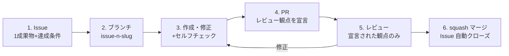

# 作成過程規約（authoring-process）v0.1

- 作成日: 2026-08-26
- 位置づけ: 三軸フレーム（research/2026-08-26_設計_三軸フレーム.md）の**作成過程軸**の運用規約。このリポジトリの全作業に適用し、運用データを M3 周6 の実験設計に使う。
- 対象: 資料の新規作成・修正・規約の導入。すべてこの一周のループで回す。

## 一周のライフサイクル

1. **Issue を切る**: 1 Issue = 1成果物。達成条件（受入条件）を本文に必須。マイルストーンを付ける
2. **ブランチ**: `issue-<番号>-<slug>` で main から切る
3. **作成・修正 + セルフチェック**: 秘匿情報スキャン（社名・実値・ARN・アカウント ID・人名）、技術的主張の出典（conventions/citation.md）、正典違反の有無（canon.md）
4. **PR を出す**: 本文で対応 Issue（`Closes #n`）と**レビュー観点**を宣言する（下記）。1 PR = 1 Issue
5. **レビュー**: オーナーは宣言された観点**だけ**を見る。修正は同じ PR にコミットを積む
6. **squash マージ**: main の履歴を「1 Issue = 1 コミット」に保つ。Issue は `Closes` で自動クローズ。実験ログ・進捗メモの更新が必要ならマージ後に行う

## レビュー種別の定義（PR 作成者が宣言する）

| 種別 | レビューで見ること | 見なくてよいこと |
|---|---|---|
| **内容** | 定義・判断・ルールに同意できるか。「これに従って運用する気になれるか」 | 文体・体裁・誤字 |
| **形式** | 規約への準拠（機構化されるまでの暫定。機構ができた項目から人のレビュー対象外にする） | 内容の是非 |
| **FYI** | 軽微な修正・機械的な変更。異議がなければそのままマージ | — |

観点を絞る理由: 人間のレビュー容量は有限で、AI 駆動の生成速度に全量レビューは追いつかない（Comprehension Debt、先行調査 §5）。人のレビューは内容の判断に集中させ、形式は機構に移管していく。

## 粒度の暫定ルール（M3 周6 の実験で検証するまでの仮置き）

- 1 Issue の成果物は「1文書」または「1規約 + その機構」を上限とする
- レビューを求める PR の差分は、オーナーが**一度に読み切れる量**（目安: 本文換算で1〜2文書分）を超えない。超えそうなら Issue を分割する
- この暫定ルール自体が仮説 H1・H3 の仮運用であり、手戻り（PR の差し戻し・Issue の分割発生)を記録して実験設計に使う

## enforcement（規約は機構が守らせる）

- 導入済みの弱い機構: `.github/pull_request_template.md`（レビュー観点の宣言とセルフチェックを強制的に想起させる）、リポジトリのマージ方式を squash のみに設定
- 未導入（願望段階）: セルフチェックの自動化（block-secrets フック = #3、出典チェック = M3 周2）、達成条件のない Issue を検出する仕組み
