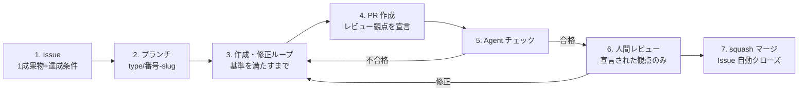

# 作成過程規約（authoring-process）v0.2

- 作成日: 2026-08-26（v0.2: オーナーレビューを反映——ブランチ命名に type を導入、作成・修正ループと Agent チェック段階を追加）
- 位置づけ: 三軸フレーム（research/2026-08-26_設計_三軸フレーム.md）の**作成過程軸**の運用規約。このリポジトリの全作業に適用し、運用データを M3 周6 の実験設計に使う。
- 対象: 資料の新規作成・修正・規約の導入。すべてこの一周のループで回す。

## 一周のライフサイクル

1. **Issue を切る**: 1 Issue = 1成果物。達成条件（受入条件）を本文に必須。マイルストーンを付ける
2. **ブランチ**: `<type>/<issue番号>-<slug>` で main から切る。type は下表
3. **作成・修正ループ**: 1回のセルフチェックで済ませず、**チェック基準をすべて満たすまで「作成 → 検査 → 修正」を繰り返す**。基準: 秘匿情報スキャン（社名・実値・ARN・アカウント ID・人名）、技術的主張の出典（conventions/citation.md）、正典違反の有無（canon.md）、リンク切れ。機構化後は lint チェーン（markdownlint / textlint / Mermaid コンパイル）もここに入る
4. **PR を出す**: 本文で対応 Issue（`Closes #n`）と**レビュー観点**を宣言する（下記）。1 PR = 1 Issue
5. **Agent チェック**: 観点の異なる複数のエージェント（出典照合・資料間矛盾・規約準拠。実装レイヤー設計 v0.1 の subagents に対応）で PR を検査し、**合格するまで人間レビューに回さない**。不合格は 3 に戻る。機構が揃うまでの暫定運用: Claude Code のサブエージェントを観点別に起動して検査する
6. **人間レビュー**: オーナーは宣言された観点**だけ**を見る。Agent チェックが通した形式・整合は人は見ない。修正は 3 のループに戻して同じ PR にコミットを積む
7. **squash マージ**: main の履歴を「1 Issue = 1 コミット」に保つ。Issue は `Closes` で自動クローズ。実験ログ・進捗メモの更新が必要ならマージ後に行う

## ブランチ type

| type | 用途 |
|---|---|
| `docs` | 資料・規約・research の追加/変更 |
| `feature` | 機構（rules / skills / hooks / subagents / CI / テンプレート）の追加 |
| `fix` | 誤りの修正 |
| `exp` | 実験の実施と記録（experiments/） |
| `chore` | 設定・整理などその他 |

例: `docs/1-canon`、`feature/3-mechanism-skeleton`、`exp/5-baseline`

## レビュー種別の定義（PR 作成者が宣言する）

| 種別 | レビューで見ること | 見なくてよいこと |
|---|---|---|
| **内容** | 定義・判断・ルールに同意できるか。「これに従って運用する気になれるか」 | 文体・体裁・誤字 |
| **形式** | 規約への準拠（Agent チェックが未整備の項目のみ。機構ができた項目から人のレビュー対象外にする） | 内容の是非 |
| **FYI** | 軽微な修正・機械的な変更。異議がなければそのままマージ | — |

観点を絞る理由: 人間のレビュー容量は有限で、AI 駆動の生成速度に全量レビューは追いつかない（Comprehension Debt、先行調査 §5）。見逃しやすい形式・整合の検査は 3 のループと 5 の Agent チェックに移し、人のレビューは内容の判断に集中させる。

## 粒度の暫定ルール（M3 周6 の実験で検証するまでの仮置き）

- 1 Issue の成果物は「1文書」または「1規約 + その機構」を上限とする
- レビューを求める PR の差分は、オーナーが**一度に読み切れる量**（目安: 本文換算で1〜2文書分）を超えない。超えそうなら Issue を分割する
- この暫定ルール自体が仮説 H1・H3 の仮運用であり、手戻り（PR の差し戻し・Issue の分割発生）を記録して実験設計に使う

## enforcement（規約は機構が守らせる）

- 導入済みの弱い機構: `.github/pull_request_template.md`（レビュー観点の宣言とセルフチェックを強制的に想起させる。様式は暫定で、運用しながら適宜改訂する）、リポジトリのマージ方式を squash のみに設定
- 未導入（願望段階）: 3 の検査の自動化（block-secrets フック = #3、lint チェーン = M3 周1〜2）、5 の Agent チェックの機構化（citation-verifier = M3 周2、consistency-checker = M3 周5、CI の claude -p 回帰 = M3 周5）、達成条件のない Issue を検出する仕組み
