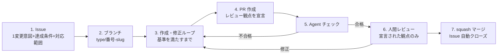

# 作成過程規約（authoring-process）v0.6

| 項目 | 内容 |
|---|---|
| 作成日 | 2026-08-26（v0.2〜v0.4 はオーナーレビューの反映。v0.5: 責務分離により、ブランチ規約を conventions/branching.md へ、Issue / PR の書式を conventions/issue-pr-format.md へ切り出し。v0.6（2026-09-05）: 「実験装置と測定対象への施策の境界」節を追加） |
| 位置づけ | 三軸フレーム（research/2026-08-26_設計_三軸フレーム.md）の**作成過程軸**の運用規約。作業の一周の流れと粒度、および実験装置と測定対象への施策の境界を定める。このリポジトリの全作業に適用し、運用データを M3 周6 の実験設計に使う |
| 対象 | 資料の新規作成・修正・規約の導入。すべてこの一周のループで回す |

## 一周のライフサイクル

1. **Issue を切る**: 1 Issue = 1変更意図（粒度の定義は「粒度の暫定ルール」節）。**達成条件**と**対応範囲**（やること / やらないこと）を本文に必須——「やらないこと」がレビューの境界になる。書かれていないと、レビュアーは意図的な割り切りと単なる不足を区別できない。必須欄の一覧は Issue / PR 書式規約（conventions/issue-pr-format.md）。マイルストーンを付ける
2. **ブランチ**: ブランチ規約（conventions/branching.md）に従い `<type>/<issue番号>-<slug>` で main から切る
3. **作成・修正ループ**: 1回のセルフチェックで済ませず、**チェック基準をすべて満たすまで「作成 → 検査 → 修正」を繰り返す**。基準: 秘匿情報スキャン（社名・実値・ARN・アカウント ID・人名）、技術的主張の出典（conventions/citation.md）、正典違反の有無（canon.md）、リンク切れ。機構化後は lint チェーン（markdownlint / textlint / Mermaid コンパイル）もここに入る
4. **PR を出す**: 1 PR = 1 Issue。本文は Issue / PR 書式規約（conventions/issue-pr-format.md）に従い、「確認したいこと」でレビュー観点を宣言する。**PR 本文がレビュー依頼の正典**——修正で内容が変わったら本文を必ず最新状態に更新し、経緯を持ち込まない。コメントは議論・質問にだけ使う
5. **Agent チェック**: 観点の異なる複数のエージェント（出典照合・資料間矛盾・規約準拠。実装レイヤー設計 v0.1、research/2026-08-25_設計_ClaudeCode実装レイヤー.md の subagents に対応）で PR を検査し、**合格するまで人間レビューに回さない**。不合格は 3 に戻る。合格したら `agent-check:passed` ラベルを付け、判定の詳細はチェック結果コメントに残す。機構が揃うまでの暫定運用: Claude Code のサブエージェントを観点別に起動して検査する
6. **人間レビュー**: オーナーは宣言された観点**だけ**を見る。Agent チェックが通した形式・整合は人は見ない。修正は 3 のループに戻して同じ PR にコミットを積む。指摘を反映したら反映コメント（書式は conventions/issue-pr-format.md）を必ず返し、あわせて本文を最新化する
7. **squash マージ**: マージ方式はブランチ規約（conventions/branching.md）に従う。Issue は `Closes` で自動クローズ。実験ログ・進捗メモの更新が必要ならマージ後に行う

## 粒度の暫定ルール（M3 周6 の実験で検証するまでの仮置き）

- **1 Issue = 1変更意図**。成果物ファイルが1つとは限らない——「ログ設計の導入」のように複数のリソース設計書（S3・CloudWatch・VPC…）に波及する変更でも、意図が1つなら1 Issue でよい
- ただしレビュー上限は維持する: PR の差分はオーナーが**一度に読み切れる量**（目安: 本文換算で1〜2文書分）まで。横断変更で超えるときは**親子 Issue に分割**する——親 = 方針の決定（ADR / 共通設計書に書く）、子 = 各設計書への反映（関連リソースをまとめて1子 Issue でよい）
- **横断変更が頻発したらフォーマット側の欠陥を疑う**: 複数の設計書で同種の記述（例: 各リソースのログ設定方針）を直して回っているなら、それはその事項を共通判断層・ADR に正典化し、各設計書は参照だけにすべきサイン（canon.md、先行調査 §2 疎結合）。理想形は「共通文書1つの修正 + 参照側は無変更」で済む状態
- 1 PR で触った文書数を記録する（= 変更波及率の観察データ。評価設計 L1。作成過程軸がフォーマット軸の欠陥を検出するセンサーになる）
- この暫定ルール自体が仮説 H1・H3 の仮運用であり、手戻り（PR の差し戻し・Issue の分割発生）を記録して実験設計に使う

## 実験装置と測定対象への施策の境界

このリポジトリで作るものは2層に分かれる。ROADMAP.md の M3 は、施策の導入・対応する enforcement 機構の実装・ハーネスでの測定・実験ログの記録を1周とするが、この「施策・機構・測定の3点セット」が要るのは下表の**測定対象への施策（以下、施策）**だけで、**実験装置（以下、装置）**は本規約の一周ループだけで導入できる。区別しないと「規約を作るたびに機構と測定が要るのか」「どこまで作り込んでから測るのか」が曖昧になる。

| 層 | 定義 | 例 | 導入の条件 |
|---|---|---|---|
| **実験装置** | 研究を回すための、リポジトリ自身の規約・テンプレート・ハーネス・機構。測定の前提であり、M3 の施策としての前後比較の対象ではない | 本規約・ブランチ規約・Issue / PR 書式規約（conventions/）、実験ログテンプレート（templates/）、Issue Form・PR テンプレート（.github/）、block-secrets フック（.claude/hooks/）、ゴールデン QA セットと採点手順（harness/、M2 で作成）。このうち sample-project/ にも適用されるものは下の「二重の役割を持つ文書」表を参照 | 本規約の一周ループで導入する。効果測定は要らない。規約は必ず enforcement とセットで実装するという中核原則（CLAUDE.md）は装置にも適用し、実装が後になる場合は各規約の enforcement 節に未導入（願望段階）と導入予定を明記する |
| **測定対象への施策** | ハーネスで前後比較する対象、すなわち sample-project/ の資料群と、それを AI が読む形に加える変更 | グロッサリ導入、出典規約の設計書への適用、設計書テンプレート、ADR 運用、AI 矛盾検出（ROADMAP.md M3 表の周1〜5） | 施策・機構・測定の3点セットが必須。1周に1施策とし、M2 のベースライン確定より前には導入しない（評価設計 v0.1 §3、research/2026-08-25_評価設計_ドキュメント施策の効果測定.md）。施策とセットの enforcement 機構は3点セットの一部として測る（ROADMAP.md §5）。装置側の機構は3点セットの測定対象ではない（装置の効果測定の扱いは本節末尾） |

**境界の判定基準は1つ**: その変更は、M2 でベースラインを測った資料セット（sample-project/ の資料と、ハーネスが AI に渡す資料）に手を入れるか。入れるなら施策、入れないなら装置。研究リポジトリ自身の文書（research/・conventions/・ROADMAP.md・experiments/）はハーネスの入力ではないので、これらへの変更は測定結果に混入せず、装置として扱える。「ハーネスが AI に渡す資料」の範囲は M2 でハーネスの入力を定義した時点で確定する（それまでは sample-project/ の資料と読む）。

**基準の適用外**: M1 の統制群（設計書 v1、Issue #4）の作成は sample-project/ に手を入れ、M2 のベースライン測定はそれを読むが、どちらも前後比較の「前」を作る作業であり、施策でも装置でもない。判定基準はベースライン確定後の変更に適用する。

**装置でもベースラインに影響するもの**: ハーネス自体（QA セット・採点プロンプト・採点モデル）は装置だが、その変更は測定条件の変更にあたる。扱いは評価設計 v0.1 §3（測定条件の固定と、モデル更新時のベースライン取り直し）に従う。

**二重の役割を持つ文書**: 次の文書は、研究リポジトリ自身に対しては装置、sample-project/ に対しては施策（またはその機構）として二重の役割を持つ。装置としての適用は人手と作成・修正ループ（手順3）の検査で行い、測定は伴わない。施策としての適用は M3 で機構・測定とセットで行う。周の割り当ては ROADMAP.md M3 表と各文書の enforcement 節を正典とし、ここには書かない（周は各周の終わりに見直してよいため）。

| 文書 | 装置として（研究リポジトリに即時適用） | 施策として（sample-project/ に M3 で適用） |
|---|---|---|
| canon.md（正典の階層） | 手順3の検査基準「正典違反の有無」 | ADR 運用と正典違反検出の施策、およびその機構 |
| 出典規約（conventions/citation.md） | 手順3の検査基準「技術的主張の出典」 | 出典規約の設計書への適用、および出典照合の機構 |
| 本規約・Issue / PR 書式規約・Issue Form | リポジトリ自身の Issue 運用ルール | 作成過程の A/B 実験（ROADMAP.md M3 表 周6）で比較する作成過程の設計、およびその機構 |

canon.md と出典規約の enforcement 節にある「現状の機構: なし（この規約はまだ「願望」段階）」は機構の有無を述べたものであり、装置としての適用（人手の検査）はすでに始まっている。

装置が研究リポジトリ自身の運用に効いたか（手戻り・作成時間）の測定は、この節では扱わない。周6 の実験設計時に、「粒度の暫定ルール」節で記録するリポジトリの Issue 運用データとあわせて検討する（ROADMAP.md §8）。

## enforcement（規約は機構が守らせる）

- 導入済み: Issue / PR テンプレートとラベル（詳細は conventions/issue-pr-format.md）、マージ方式の設定（詳細は conventions/branching.md）、block-secrets フック（手順3の秘匿情報検査を機械化。#3 で導入）
- 未導入（願望段階）: 3 の残りの検査の自動化（lint チェーン = M3 周1〜2）、5 の Agent チェックの機構化（citation-verifier = M3 周2、consistency-checker = M3 周5、CI の claude -p 回帰 = M3 周5）、装置 / 施策の境界の機械検査（sample-project/ を変更する PR が M3 の実験 Issue を参照していることの CI チェック。M2 のベースライン記録後に導入）
