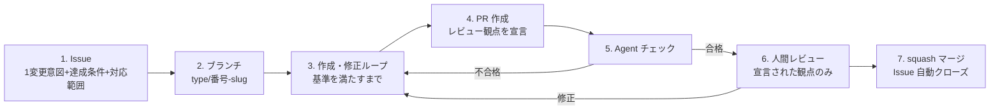

# 作成過程規約（authoring-process）v0.5

| 項目 | 内容 |
|---|---|
| 作成日 | 2026-08-26（v0.2〜v0.4 はオーナーレビューの反映。v0.5: 責務分離により、ブランチ規約を conventions/branching.md へ、Issue / PR の書式を conventions/issue-pr-format.md へ切り出し） |
| 位置づけ | 三軸フレーム（research/2026-08-26_設計_三軸フレーム.md）の**作成過程軸**の運用規約。作業の一周の流れと粒度を定める。このリポジトリの全作業に適用し、運用データを M3 周6 の実験設計に使う |
| 対象 | 資料の新規作成・修正・規約の導入。すべてこの一周のループで回す |

## 一周のライフサイクル

1. **Issue を切る**: 1 Issue = 1変更意図（粒度の定義は「粒度の暫定ルール」節）。**達成条件**と**対応範囲**（やること / やらないこと）を本文に必須——「やらないこと」がレビューの境界になる。必須欄の一覧は Issue / PR 書式規約（conventions/issue-pr-format.md）。マイルストーンを付ける
2. **ブランチ**: ブランチ規約（conventions/branching.md）に従い `<type>/<issue番号>-<slug>` で main から切る
3. **作成・修正ループ**: 1回のセルフチェックで済ませず、**チェック基準をすべて満たすまで「作成 → 検査 → 修正」を繰り返す**。基準: 秘匿情報スキャン（社名・実値・ARN・アカウント ID・人名）、技術的主張の出典（conventions/citation.md）、正典違反の有無（canon.md）、リンク切れ。機構化後は lint チェーン（markdownlint / textlint / Mermaid コンパイル）もここに入る
4. **PR を出す**: 1 PR = 1 Issue。本文は Issue / PR 書式規約（conventions/issue-pr-format.md）に従い、「確認したいこと」でレビュー観点を宣言する。**PR 本文がレビュー依頼の正典**——修正で内容が変わったら本文を必ず最新状態に更新し、経緯を持ち込まない。コメントは議論・質問にだけ使う
5. **Agent チェック**: 観点の異なる複数のエージェント（出典照合・資料間矛盾・規約準拠。実装レイヤー設計 v0.1、research/2026-08-25_設計_ClaudeCode実装レイヤー.md の subagents に対応）で PR を検査し、**合格するまで人間レビューに回さない**。不合格は 3 に戻る。合格したら `agent-check:passed` ラベルを付け、判定の詳細はチェック結果コメントに残す。機構が揃うまでの暫定運用: Claude Code のサブエージェントを観点別に起動して検査する
6. **人間レビュー**: オーナーは宣言された観点**だけ**を見る。Agent チェックが通した形式・整合は人は見ない。修正は 3 のループに戻して同じ PR にコミットを積む。指摘を反映したら反映コメント（書式は conventions/issue-pr-format.md）を必ず返し、あわせて本文を最新化する
7. **squash マージ**: マージ方式はブランチ規約（conventions/branching.md）に従う。Issue は `Closes` で自動クローズ。実験ログ・進捗メモの更新が必要ならマージ後に行う

## 粒度の暫定ルール（M3 周6 の実験で検証するまでの仮置き）

- **1 Issue = 1変更意図**。成果物ファイルが1つとは限らない——「ログ設計の導入」のように複数のリソース設計書（S3・CloudWatch・VPC…）に波及する変更でも、意図が1つなら1 Issue でよい
- ただしレビュー上限は維持する: PR の差分はオーナーが**一度に読み切れる量**（目安: 本文換算で1〜2文書分）まで。横断変更で超えるときは**親子 Issue に分割**する——親 = 方針の決定（ADR / 共通設計書に書く）、子 = 各設計書への反映（関連リソースをまとめて1子 Issue でよい）
- **横断変更が頻発したらフォーマット側の欠陥を疑う**: 複数の設計書で同種の記述（例: 各リソースのログ設定方針）を直して回っているなら、それはその事項を共通判断層・ADR に正典化し、各設計書は参照だけにすべきサイン（canon.md、先行調査 §2 疎結合）。理想形は「共通文書1つの修正 + 参照側は無変更」で済む状態
- 1 PR で触った文書数を記録する（= 変更波及率の観察データ。評価設計 L1。作成過程軸がフォーマット軸の欠陥を検出するセンサーになる）
- この暫定ルール自体が仮説 H1・H3 の仮運用であり、手戻り（PR の差し戻し・Issue の分割発生）を記録して実験設計に使う

## enforcement（規約は機構が守らせる）

- 導入済み: Issue / PR テンプレートとラベル（詳細は conventions/issue-pr-format.md）、マージ方式の設定（詳細は conventions/branching.md）
- 未導入（願望段階）: 3 の検査の自動化（block-secrets フック = 導入済み #3、lint チェーン = M3 周1〜2）、5 の Agent チェックの機構化（citation-verifier = M3 周2、consistency-checker = M3 周5、CI の claude -p 回帰 = M3 周5）
