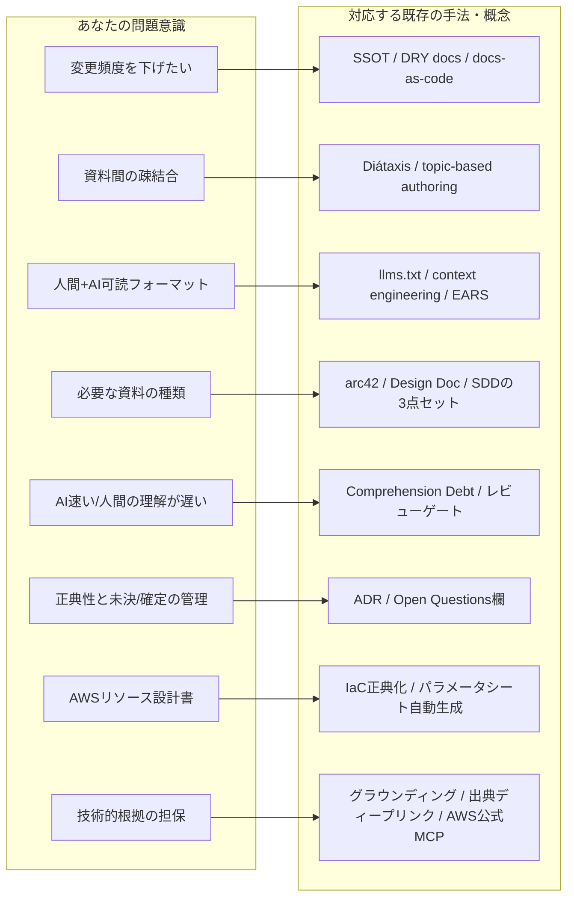

# AI駆動開発時代のドキュメント論 — 先行研究・既存手法の調査レポート

- 調査日: 2026-08-25（同日追記: §8 根拠の一次情報化、§9 盲点になりやすい観点）
- 目的: 「AI駆動開発における資料の質・矛盾・変更頻度・フォーマット・理解速度のギャップ」という問題意識に対して、既に存在する手法・研究・議論を調査し、自分の考えと対応付ける。

## 結論（先に要点）

あなたが挙げた問題意識は、**そのほぼすべてが 2024〜2026 年にかけて世界中で急速に形成されつつある分野と一致している**。名前が付いている概念が多く、「Spec-Driven Development（仕様駆動開発）」「Comprehension Debt（理解負債）」「llms.txt / LLM-friendly docs」「Diátaxis」「ADR」などがそれに当たる。つまり「同じことを考えている人はいるか？」への答えは明確に **Yes**。

一方で「研究として結果が出ているか？」への答えは **部分的に Yes、大部分はまだ**。Diátaxis や ADR のような AI 以前からの手法は実績が確立しているが、AI 駆動開発専用のドキュメント体系（SDD など）は Thoughtworks Technology Radar でもまだ「Assess（評価段階）」であり、学術研究も 2026 年に始まったばかり。**「確立された正解」はまだ存在せず、実務者が各自の体系を組み立てている段階**。だからこそ、あなたのこの研究プロジェクトには十分な意味と余地がある。

---

## 1. 「資料が頻繁に書き換わらない仕組み」への先行手法

この問題は既存の世界では **Single Source of Truth（SSOT: 信頼できる唯一の情報源）** と、DRY 原則（Don't Repeat Yourself）のドキュメント適用として扱われている。核となる考え方はこうだ。

**「変わりやすい事実」はドキュメントに書かず、事実の在り処（正典）への参照だけを書く。** あなたの「現在のユーザー30人」の例で言えば、ユーザー数の正典はダッシュボードや DB であって設計書ではない。設計書に書くべきは「ユーザー数の想定レンジは〜1,000人。現在値は○○ダッシュボード参照」のように、**設計判断に効く抽象化された値と、参照先**である。数値そのものを複製した瞬間、SSOT が壊れて矛盾の種になる——これは [SSOT の定義そのもの](https://en.wikipedia.org/wiki/Single_source_of_truth)（「すべてのデータ要素を一箇所でだけ編集し、他はすべて参照にする」）に対応する。

もうひとつの柱が **docs-as-code**（[Write the Docs のガイド](https://www.writethedocs.org/guide/docs-as-code/)、[Kong の解説](https://konghq.com/blog/learning-center/what-is-docs-as-code)）で、ドキュメントをコードと同じリポジトリ・同じレビュー・同じ CI で管理する。ここから派生する重要な実践が「**生成できる情報は手で書かず生成する**」——たとえばインフラのパラメータ一覧は IaC コードから自動生成すれば、修正回数はゼロになる（§7 で詳述）。

整理すると、変更頻度を下げる仕組みは既存の議論では次の3層で語られている。**(a) 揮発性の高い事実は参照化する**（値を書かない）、**(b) 導出可能な情報は自動生成する**（手で書かない）、**(c) 残った「人間の判断・意図」だけを手書きする**（これは本質的に変わりにくい）。設計の Why、採用しなかった代替案、制約条件などは時間が経っても変わらないため、「Why 中心のドキュメント」は自然と evergreen（腐りにくい）になる。

## 2. 「資料間の疎結合」への先行手法

これはドキュメント界では古くからあるテーマで、最も体系化されているのが **[Diátaxis](https://diataxis.fr/)**（Django のドキュメント責任者だった Daniele Procida が体系化、[Canonical/Ubuntu が全社採用](https://ubuntu.com/blog/diataxis-a-new-foundation-for-canonical-documentation)）。ドキュメントを「Tutorial（学習）/ How-to（作業手順）/ Reference(事実) / Explanation（背景・Why）」の4象限に**責務分離**し、しかも [Diátaxis 自身が明言している](https://diataxis.fr/start-here/)のは「**境界を混ぜること・ぼかすことが、ドキュメント問題の根源である**」という点。あなたの「責務の分離的な考え」は、この分野ではまさに中心原理として確立している。

疎結合の観点で Diátaxis から取り込めるのは次の発想だ。矛盾は多くの場合「同じ事実が複数の文書に書かれている」ことから生じる。だから**事実（Reference）を一箇所に集約し、他の文書は事実を再記述せずに参照する**。手順書や解説が事実を抱え込まなければ、事実が変わっても Reference だけを直せばよい。

より古い系譜では **topic-based authoring / DITA**（トピック単位で自己完結した文書を書き、組み合わせて成果物を作る技術文書の標準）があり、また構造レベルでは **[arc42](https://github.com/bitsmuggler/arc42-c4-software-architecture-documentation-example)**（アーキテクチャ文書の12章テンプレート）と **C4 モデル**（Context / Container / Component / Code の4階層で図の詳細度を分離する）が「**詳細度による分離**」を提供する。C4 の階層分離は「上位の図は下位の変更で書き換わらない」ように設計されており、これは資料間の安定依存（変わりにくいものにだけ依存する）と同じ構造をしている。

## 3. 「人間にもAIにも読みやすいフォーマット」への先行手法

ここは 2025〜2026 年で最も動きが激しい領域で、あなたの直感（md + Mermaid）は現在の主流の結論と一致している。

**Markdown が LLM 向けの事実上の標準**になっている。[Fern の LLM-friendly documentation ガイド](https://buildwithfern.com/post/how-to-write-llm-friendly-documentation)によれば、HTML から Markdown への変換だけで**トークン消費が80〜90%削減**される。同ガイドの実践則は、そのままあなたのフォーマット設計の材料になる: 見出し階層を一貫させる（H2=主要トピック、H3=サブトピック）、**各セクションを「単独で切り出されても意味が通る」自己完結の単位にする**、参照は「前述の方法」でなく「OAuth 2.0 認証」のように**明示的に書く**（AI がチャンク単位で読んでも文脈が壊れない）。サイト・リポジトリのルートに [llms.txt](https://www.mintlify.com/blog/what-is-llms-txt)（AI 向けの構造化された目次ファイル）を置く動きも標準化しつつある。

Anthropic 自身の [context engineering ガイド](https://www.anthropic.com/engineering/effective-context-engineering-for-ai-agents)は設計原理を与えてくれる: LLM の注意力は有限の予算であり、**「最小限の高シグナルトークン」で最大の効果を出す**こと、全部を事前に読み込ませるのではなく**軽量な識別子（目次・ファイル名・見出し）を頼りに just-in-time で必要な部分だけ読み込ませる**こと。つまり「資料の目次・概要を最初に固めたい」というあなたの考えは、AI の just-in-time 読み込みの観点からも正しい——**目次と概要は人間のためだけでなく、AI が「どのファイルのどの節を読むべきか」を判断するためのインデックス**として機能する。

図については **diagram as code**（Mermaid、C4-PlantUML）が docs-as-code と組み合わされて使われており（[arc42 + C4 + docs-as-code の実例リポジトリ](https://github.com/bitsmuggler/arc42-c4-software-architecture-documentation-example)）、Mermaid をテキストとして Git 管理すれば AI が図を生成・検証・修正できる。「Mermaid を綺麗に作る仕組み」は、C4 モデルのような**図の記法規約**（各階層で描いてよい要素・粒度を決める）を先に定めるのが既存のアプローチ。

フォーマットの効果には**実証研究も出ている**（2026-08-25 追記）。[Architecture as Capability Equalizer for Coding Agents（arXiv 2608.21747, 2026）](https://arxiv.org/abs/2608.21747)は、**情報として等価な**アーキテクチャ仕様を5形式（散文 / Mermaid図+ADR / OpenAPI / C4 DSL / TypeScript インターフェース契約）で用意し、6モデル×90試行でコーディングエージェントの生成コード品質を比較した。結果: (a) 最強クラスのモデルでは形式の影響は小さいが、**弱い（安い）モデルほど形式の差が大きく効く**、(b) OpenAPI や型契約のような「コードに近い形式」が弱いモデルの性能を大きく回復させる（最弱モデルの API 経路カバレッジが 33%→100%）。つまり**構造化された仕様は「能力の均等化装置」として働き、その価値はモデル能力に反比例する**。この研究の含意は2つ: 資料フォーマットの良し悪しは安いモデルを使うときほど効く（=フォーマット改善はコスト削減に直結する）こと、そして設計書に IaC スニペットのような「コードに近い断片」を含めることには実証的な裏付けがあること。

文章レベルでは **EARS 記法**（Easy Approach to Requirements Syntax）が注目に値する。要求文を5パターン（「システムは〜すること」「〜のとき、システムは〜すること」等）に限定する記法で、AWS の Kiro が採用しており、**人間にも AI にも曖昧さなく読める要求文**の標準として SDD 界隈で使われている（[SDD 2026 解説](https://dev.to/krlz/spec-driven-development-in-2026-what-it-is-the-tooling-and-how-teams-actually-use-it-2fk2)）。

## 4. 「開発に必要な資料が何かわからない」への先行手法

ここで最も参考になるのが **Spec-Driven Development（SDD: 仕様駆動開発）** の潮流。AWS の **Kiro**、**GitHub Spec Kit**、**OpenSpec**、**cc-sdd**（Claude Code 向け）などのツール群が 2025〜2026 年に一斉に登場し、AI 駆動開発における「必要な資料の最小セット」に事実上の共通解が生まれつつある（[SDD ツール比較](https://www.augmentcode.com/tools/best-spec-driven-development-tools)、[Kiro / Spec Kit / BMAD 比較](https://medium.com/@visrow/comprehensive-guide-to-spec-driven-development-kiro-github-spec-kit-and-bmad-method-5d28ff61b9b1)）。その共通解とは概ね次の構成である。

プロジェクト全体に1つ: **constitution**（プロジェクト憲法。言語・フレームワーク・テスト方針など AI への恒常ルール。CLAUDE.md / AGENTS.md がこれに相当）。機能ごとに3点セット: **spec.md**（What と Why。ユーザーストーリー + EARS 形式の受入条件）、**plan.md / design.md**（技術設計。スタック選定、データモデル、アーキテクチャ判断）、**tasks.md**（仕様の節を明示参照する原子的タスク分解）。そしてワークフローは `Constitution → Specify → Clarify → Plan → Tasks → Implement → Analyze` で、**各フェーズに人間のレビューゲート**を置く。

もうひとつの答え方が Diátaxis の運用原則で、「**完全なテンプレートを最初に全部埋めようとするな。必要が生じた文書から書け**」という立場。PJ ごとに必要文書が違うというあなたの認識は正しく、既存の知見は「全 PJ 共通の文書リスト」ではなく「**文書の型（責務の分類）と、型ごとのフォーマットを決めておき、必要になった型から作る**」という形で答えている。網羅的な型のカタログとしては arc42（12章）や Google の Design Doc 文化、ADR、Runbook などがある（[アーキテクチャ文書化の総合ガイド](https://www.workingsoftware.dev/software-architecture-documentation-the-ultimate-guide/)）。

## 5. 「AIは速いが人間の理解が追いつかない」への先行研究

この問題には 2026 年に **Comprehension Debt（理解負債）** という名前が付いた。Google Chrome チームの Addy Osmani が[広く読まれた論考](https://addyosmani.com/blog/comprehension-debt/)で定義したもので、「**コードベースに存在するコード量と、人間が実際に理解している量の乖離**」を指す。彼の指摘はあなたの悩みと完全に重なる: AI は人間が評価できる速度を遥かに超えて生成する、従来「教育的なボトルネック」だったレビューが機能しなくなる、テストは想定外の振る舞いを検出できない、そして**仕様から実装への翻訳には仕様に書かれない暗黙の決定が大量に含まれる**。同様の議論は[「理解こそが新しいボトルネック」](https://braindetox.kr/en/posts/understanding_new_bottleneck_2026.html)、[CodeRabbit の「レビューのボトルネックは意図の理解」](https://www.coderabbit.ai/blog/bottleneck-in-code-review-is-understanding-intent)など 2026 年に多数出ている。

対策として提案されているのは、(a) **変更の前に意図を明文化する**（生成前の spec が人間の理解の錨になる — SDD がまさにこの思想）、(b) **フェーズごとのレビューゲート**で「全部できたものを一気に理解する」のではなく「小さな判断を段階的に承認する」形にする、(c) SDD の **Clarify フェーズ**のように **AI 自身に曖昧さ・矛盾を先に指摘させる**、(d) SDD の **Analyze フェーズ**のように **spec・plan・tasks 間の整合性チェックを AI にやらせる**、というもの。つまり「AI が見逃した矛盾を人間が見逃す」問題への現在の答えは、**人間が全量を理解する前提を捨て、矛盾検出そのものを AI の明示的なタスクとして体系に組み込む**方向にある。ただし Osmani は「テストと仕様だけでは不十分で、システムレベルの理解を持つ人間を維持することが必要」とも警告しており、ここは未解決問題として認識されている。

## 6. 「正典性と未決/確定の管理」への先行手法

これはソフトウェア界で最も確立された答えがある領域で、**ADR（Architecture Decision Record: アーキテクチャ決定記録）** がそれ（[Google Cloud のガイド](https://docs.cloud.google.com/architecture/architecture-decision-records?hl=ja)、[日本語の実践記事](https://zenn.dev/maman/articles/f91a52bc06024d)）。1決定=1ファイルで「コンテキスト / 決定 / 結果」を記録し、**status フィールド（proposed → accepted → superseded など）** を持つ。重要な性質が2つある。第一に、**決定は上書きせず、新しい ADR で置き換える**（追記型のログ）。第二に、status によって「これは未決の提案なのか、確定した決定なのか、既に廃止されたのか」が機械的に判別できる。

あなたの「議事録を正典として扱ってしまう」問題への既存の答えはこう整理できる: **議事録は決定の「ソース（原資料）」であって「正典」ではない。議事録から決定を抽出して ADR に起こした時点で、ADR が正典になり、議事録は出典として ADR からリンクされるだけの存在になる。** 設計書は決定の理由を再記述せず ADR を参照する。こうすると「上長が決めたこと」の転記ミスは ADR 化の一箇所だけでレビューでき、矛盾の混入点が一点に絞られる。

「未決事項が資料中に散りばめられて読みづらい」問題には、Google 系 Design Doc の定番セクションである **Open Questions（未解決の論点）** が対応する。未決事項は本文中に散らさず文書末尾（またはプロジェクト共通の decision log）に集約し、本文には「（→ Open Questions #3）」のような参照だけを置く。未決が確定したら ADR を起こし、Open Questions から消して本文の参照を ADR に差し替える——という一方向のライフサイクルにするのが実務パターン。

## 7. 「AWSリソース設計書」への先行手法

日本の SIer 文化の「パラメータシート」問題は、IaC 時代にはっきりした方向性が出ている: **リソースの What（設定値）の正典は IaC コード（Terraform / CloudFormation）であり、パラメータシートは書くものではなく生成するもの**。実際に[パラメータシート自動生成の取り組み](https://blog.usize-tech.com/aws-auto-create-parameter-sheets-requirements/)や terraform-docs のようなツールが存在し、逆方向（[パラメータシートから CloudFormation を生成](https://blog.usize-tech.com/cfn-template-auto-creation/)）の試みすらある。AWS 公式も [CloudFormation テンプレートの効率的作成](https://aws.amazon.com/jp/builders-flash/202403/create-cloudformation-efficiently/)などで IaC を設計の中心に置いている。

この原則に立つと、あなたが悩んでいる「リソースごとに必要な項目が違う」問題は次のように解ける。**設定値の網羅はコード（正典）に任せる**ので、手書きの設計書からリソース別の設定項目表を頑張って統一する必要はなくなる。手書き設計書に残すのは、リソース種別に依らず共通化できる「判断」の層——このリソースの目的と責務、なぜこの構成にしたか（ADR への参照）、可用性・スケーリングの方針、セキュリティ境界、コストの考え方、依存関係（Mermaid の構成図）——であり、**これは §1 の「Why 中心の文書は変わりにくい」原則ともそのまま噛み合う**。リソース固有で書くべきことが本当にある場合（例: RDS のバックアップ設計、IAM の権限設計方針）だけ、固有セクションを追加する2層構造（共通項目 + リソース固有項目)が現実的で、これは topic-based authoring の「共通トピック + 特化トピック」の考え方と同型。

## 8. 「技術的な根拠の担保」への先行手法

AIが「要件に沿っているが実際にはできない・一般的でない設計」を出してくる問題は、**グラウンディング（grounding: 生成内容を一次情報に接地させること）** と呼ばれ、ハルシネーション対策の中心テーマとして確立している。答えは「資料側の工夫」と「ワークフロー側の工夫」の2層に分かれる。

**資料側 — 出典を「開いたらその場所に飛ぶ」形にする。** これには **Text Fragments** というブラウザ標準機能がそのまま使える。URL の末尾に `#:~:text=対象の文言` を付けると、開いた瞬間に該当文までスクロールし、ハイライト表示される（[MDN のリファレンス](https://developer.mozilla.org/en-US/docs/Web/URI/Reference/Fragment/Text_fragments)、[web.dev の解説](https://web.dev/articles/text-fragments)）。日本語もパーセントエンコードすれば動き、主要ブラウザが対応済み。ページ側の文言が変わった場合は単にページ先頭が表示されるだけなので、壊れても実害がないのも資料向き。AWS 公式ドキュメントは節ごとのアンカー（`#sectiontitle`）も持つので、「アンカー + text fragment」を重ねると精度と耐久性を両立できる。

**資料側 — 肥大化させない出典様式。** 本文には技術的主張と脚注マーカーだけを書き、文書末尾の「根拠」節に (a) 最小限の抜粋（原文1〜2文の引用）、(b) ディープリンク、(c) 参照日、の3点セットで置く。抜粋はリンク切れ・原文変更への保険であって転載ではないので、2文以内などの上限をルール化する。これは constitution（§4）に「技術的主張には一次情報の出典を必須とする。抜粋は2文以内」と書けば AI にも強制できる。加えて**出典の格付け**を決めておく: 一次（AWS 公式ドキュメント・公式ブログ）> 二次（実績ある技術ブログ）> その他、とし、二次以下しか根拠がない主張は「一般的でない可能性あり」のシグナルとしてマークする。

**ワークフロー側 — AI に記憶でなく公式ドキュメントを読ませる。** ここには AWS 公式の答えが既にある。**[AWS Knowledge MCP Server](https://awslabs.github.io/mcp/servers/aws-knowledge-mcp-server)**（ホスト型・AWS 認証不要・GA。最新ドキュメント、What's New、リージョン別 API 可用性まで索引）と [AWS Documentation MCP Server](https://mcpservers.org/servers/awslabs/aws-documentation-mcp-server)（[awslabs/mcp](https://github.com/awslabs/mcp) の一部）で、AI エージェントが設計中に公式ドキュメントを検索・閲覧し、出典 URL 付きで回答できるようになる。「公式ドキュメントを検索してから設計し、各判断に出典 URL を付けよ」という指示と組み合わせれば、記憶ベースの設計がグラウンディングされた設計に変わる。さらに §5 の Analyze の文書版として、**設計した AI とは別パスで「各技術的主張について出典を開き、主張と本当に一致するか」を敵対的に照合する検証工程**を置くのが現在のベストプラクティス。

最後に、「一般的でない」はドキュメント照合で捕まえられるが、「**実際にはできない**」を最終的に保証するのは文書ではなく**実行**である点は押さえておきたい。設計書の主張のうち実行で検証できるものは IaC スニペット（CFn テンプレート断片）として書かせ、cfn-lint / validate-template やサンドボックスへの最小デプロイで確認する。「その設計を CFn で表現できない」こと自体が、できない設計の早期シグナルになる。

## 9. まだ挙がっていない観点 — 盲点になりやすい領域

これまでの8つの問題意識でカバーされていない、既存の議論で重要とされる観点を挙げる。

**用語の統一（グロッサリ）。** 資料間の矛盾のかなりの部分は、事実の食い違いではなく「同じものを違う名前で呼ぶ・違うものを同じ名前で呼ぶ」ことから生じる。DDD の「ユビキタス言語」が体系化している通り、glossary.md 一枚（用語・定義・言い換え禁止語）は最も安価な矛盾対策で、用語は一度定めればほぼ変わらないため §1 の evergreen 原則にも適合する。AI への効果も大きい——用語が揺れていると AI は別概念として扱い、矛盾を「検出できない」。

**資料のメタデータとライフサイクル。** 各資料の冒頭に、オーナー、status（draft / review / approved / deprecated）、最終レビュー日、対象読者を持たせる。重要なのは資料を「作る」仕組みと同じくらい「**死なせる**」仕組みで、deprecated を明示しないと古い資料が生きた資料と矛盾し続ける（ADR の status フィールドの資料版）。最終レビュー日は人間だけでなく AI に「この情報の鮮度」を伝えるメタデータとしても機能する。

**資料の CI（自動検査）。** docs-as-code の延長で、資料そのものをテストする。markdownlint（整形）、textlint（日本語の校正・グロッサリとの用語照合）、リンク切れチェッカー、Mermaid のコンパイル確認、そして AI による資料間矛盾チェックを CI に組み込む。矛盾の発見を人間の注意力ではなく自動テストの仕事にする発想で、[GitLab は実際に文書テストを CI で運用している](https://docs.gitlab.com/development/documentation/testing/)（[docs linting の解説](https://www.netlify.com/blog/a-key-to-high-quality-documentation-docs-linting-in-ci-cd/)）。§8 の出典ルール（「技術的主張に出典があるか」）も lint 化できる。

**トレーサビリティ（変更影響の追跡）。** 要件→設計→タスク→コード/テストの参照リンクを一貫して張る。SDD の tasks.md が spec の節番号を明示参照するのはこの実装で、効能は**変更影響分析**——「この決定が変わったらどの資料のどの節が影響を受けるか」を機械的に辿れる。§2 の疎結合が「矛盾を生まない」ための構造なら、トレーサビリティは「それでも変更が起きたときに矛盾を残さない」ための構造で、両者は対になる。

**AI への Q&A で資料品質を測る。** AI 時代ならではの新しい観点として、資料の品質は「**AI に資料だけを渡して質問し、正しく答えられるか**」でテストできる。答えられない・間違える箇所は、資料の欠落・曖昧さ・矛盾の検出器になる。資料のユニットテストに相当する概念で、確立された名前はまだないが、SDD の評価（eval）の流れと合流しつつある。あなたの研究の独自貢献にできる可能性がある領域。

**秘匿情報と資料の境界。** AI に資料を読ませる前提では、資料に認証情報・実パラメータの機微値・個人情報を書かない規律がこれまで以上に重要になる（AI のコンテキストやログに流れるため）。「実値は資料に書かず参照にする」という §1 の結論が、セキュリティの観点からも独立に正当化される。

**検索性・情報アーキテクチャ。** §3 で目次に触れたが、より広く、ファイル名・フォルダ構造・1ファイル1責務の粒度設計そのものが、AI の just-in-time 読み込み（§3）のインデックスとして機能する。命名規約は「人間の趣味」ではなく「AI が必要なファイルだけを開くための API 設計」と捉え直すのが AI 時代の見方。

## 10. 研究として確立しているか — 現在地の評価

**確立済み（AI 以前からの蓄積）**: Diátaxis（Canonical/Ubuntu が全社採用）、ADR（Google Cloud・AWS が公式推奨）、arc42 + C4、docs-as-code（Write the Docs コミュニティ）、Specification by Example / living documentation（[Gojko Adzic、実行可能な仕様でドキュメントの陳腐化を防ぐ手法。10年の実践知見あり](https://gojko.net/2020/03/17/sbe-10-years.html)）。これらは実績があり、安心して土台にできる。

**形成中（AI 駆動開発固有、結果はまだ）**: SDD は Thoughtworks Technology Radar で「Adopt」ではなく「**Assess（評価中）**」であり、「ウォーターフォールの再来ではないか」という批判も存在する（[SDD 2026 解説の懐疑論セクション](https://dev.to/krlz/spec-driven-development-in-2026-what-it-is-the-tooling-and-how-teams-actually-use-it-2fk2)）。「間違った仕様に一致した実装は何も満たさない」という偽の安心感リスクも指摘されている。学術側では、仕様書が異なる AI エージェント間でどれだけ通用するかを調べる研究（[Specification Portability Across LLM Development Agents, arXiv 2608.21208, 2026](https://arxiv.org/abs/2608.21208v1)）や [LLM エージェント×ソフトウェア工学のサーベイ群](https://github.com/fudanselab/agent4se-paper-list)が出始めた段階。特に [Architecture as Capability Equalizer（arXiv 2608.21747, 2026）](https://arxiv.org/abs/2608.21747)は「等価な内容・異なる形式の仕様で AI の成果物品質を統制比較する」という、**本プロジェクトの評価設計（同内容・形式違いの A/B 比較）とほぼ同型の実験手法**を既に実施しており、フォーマット領域（§3）に限れば実証結果が出始めていると言える。ただし対象はアーキテクチャ仕様1文書に限られ、資料体系全体（正典の階層、ADR 運用、矛盾検出、ライフサイクル）を扱う実証研究はまだ薄い。

**含意**: 車輪の再発明は避けられる（各問題意識に対応する既存部品がある）が、**それらを統合した「AI 駆動開発のための文書体系」の決定版はまだ誰も持っていない**。既存部品を組み合わせて自分の PJ（特に AWS インフラ文書）で検証する、というこのプロジェクトの方向性は、現在の空白地帯を突いている。

## 次の一歩の候補（このプロジェクトとして）

調査結果を踏まえると、最初に固めると効果が大きいのは「**正典の階層の定義**」だと考えられる。すなわち、事実の正典 = IaC コード・実データ（文書には参照だけ書く）、決定の正典 = ADR（status 付き、追記型）、意図の正典 = spec（EARS 形式の受入条件）、そして議事録・チャットは正典ではなくソース、という4層を先に宣言してしまう。この土台の上でなら、「共通フォーマット（概要・目次・参照規約）+ 文書型ごとの固有セクション」の設計、Mermaid の記法規約（C4 準拠の粒度ルール）、AWS リソース設計書の2層テンプレート、AI による矛盾検出をワークフローに組み込む手順、が順に設計できる。なお §8 の出典規約（一次情報必須・抜粋2文以内・text fragment ディープリンク・参照日）と §9 のグロッサリは、他の設計に依存せず今日からでも導入でき、導入が早いほど効くタイプの部品なので、先行して決めてしまってよい。この続きは次回以降のセッションで具体化できる。

---

## 主要ソース

- Spec-Driven Development: [SDD in 2026 (DEV Community)](https://dev.to/krlz/spec-driven-development-in-2026-what-it-is-the-tooling-and-how-teams-actually-use-it-2fk2) / [ツール比較 (Augment Code)](https://www.augmentcode.com/tools/best-spec-driven-development-tools) / [Kiro・Spec Kit・BMAD 比較 (Medium)](https://medium.com/@visrow/comprehensive-guide-to-spec-driven-development-kiro-github-spec-kit-and-bmad-method-5d28ff61b9b1)
- 理解負債: [Comprehension Debt (Addy Osmani)](https://addyosmani.com/blog/comprehension-debt/) / [Understanding Is the New Bottleneck](https://braindetox.kr/en/posts/understanding_new_bottleneck_2026.html) / [CodeRabbit: レビューの本当のボトルネック](https://www.coderabbit.ai/blog/bottleneck-in-code-review-is-understanding-intent)
- 文書の責務分離: [Diátaxis](https://diataxis.fr/) / [Start here](https://diataxis.fr/start-here/) / [Canonical の採用事例](https://ubuntu.com/blog/diataxis-a-new-foundation-for-canonical-documentation)
- AI 可読フォーマット: [LLM-friendly docs (Fern)](https://buildwithfern.com/post/how-to-write-llm-friendly-documentation) / [llms.txt とは (Mintlify)](https://www.mintlify.com/blog/what-is-llms-txt) / [Anthropic: Effective context engineering](https://www.anthropic.com/engineering/effective-context-engineering-for-ai-agents)
- SSOT / docs-as-code: [Single source of truth (Wikipedia)](https://en.wikipedia.org/wiki/Single_source_of_truth) / [Docs as Code (Write the Docs)](https://www.writethedocs.org/guide/docs-as-code/) / [Kong の解説](https://konghq.com/blog/learning-center/what-is-docs-as-code)
- 決定の記録: [ADR (Google Cloud)](https://docs.cloud.google.com/architecture/architecture-decision-records?hl=ja) / [ADR 実践 (Zenn)](https://zenn.dev/maman/articles/f91a52bc06024d)
- アーキテクチャ文書: [arc42 + C4 + docs-as-code 実例](https://github.com/bitsmuggler/arc42-c4-software-architecture-documentation-example) / [文書化総合ガイド (workingsoftware.dev)](https://www.workingsoftware.dev/software-architecture-documentation-the-ultimate-guide/)
- AWS / IaC: [パラメータシート自動生成の要件定義 (TechHarmony)](https://blog.usize-tech.com/aws-auto-create-parameter-sheets-requirements/) / [CloudFormation 効率的作成 (AWS builders.flash)](https://aws.amazon.com/jp/builders-flash/202403/create-cloudformation-efficiently/)
- 実行可能な仕様: [Specification by Example, 10 years later (Gojko Adzic)](https://gojko.net/2020/03/17/sbe-10-years.html)
- 学術研究: [Architecture as Capability Equalizer for Coding Agents (arXiv 2608.21747)](https://arxiv.org/abs/2608.21747) / [Specification Portability Across LLM Development Agents (arXiv 2608.21208)](https://arxiv.org/abs/2608.21208v1) / [Agent4SE Paper List (Fudan SE Lab)](https://github.com/fudanselab/agent4se-paper-list)
- 出典ディープリンク: [Text fragments (MDN)](https://developer.mozilla.org/en-US/docs/Web/URI/Reference/Fragment/Text_fragments) / [Text Fragments 解説 (web.dev)](https://web.dev/articles/text-fragments)
- AWS 公式 MCP: [AWS Knowledge MCP Server](https://awslabs.github.io/mcp/servers/aws-knowledge-mcp-server) / [AWS Documentation MCP Server](https://mcpservers.org/servers/awslabs/aws-documentation-mcp-server) / [awslabs/mcp (GitHub)](https://github.com/awslabs/mcp) / [AWS MCP Server GA アナウンス](https://aws.amazon.com/blogs/aws/the-aws-mcp-server-is-now-generally-available/)
- 資料の CI: [GitLab Documentation testing](https://docs.gitlab.com/development/documentation/testing/) / [Docs Linting in CI/CD (Netlify)](https://www.netlify.com/blog/a-key-to-high-quality-documentation-docs-linting-in-ci-cd/) / [markdownlint](https://github.com/davidanson/markdownlint)

