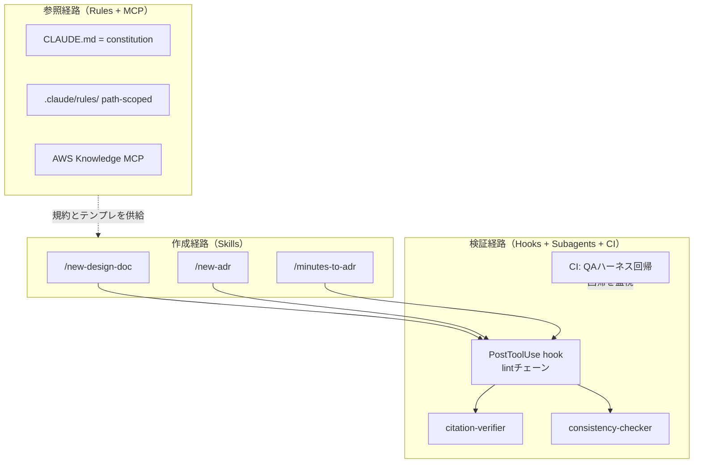

# Claude Code 実装レイヤー設計 v0.1 — 資料体系を「機構」にする

- 作成日: 2026-08-25
- 位置づけ: この研究の第2の柱。資料体系（規約・テンプレート・正典）を「人が覚えて守る運用ルール」で終わらせず、Claude Code の機構——rules / skills / subagents / hooks / MCP / CI——によって**確実に・正確に・高速に**作成・検証・参照される仕組みに落とす。
- 対応するロードマップ: ROADMAP.md の「機構化ライン」。各実験サイクル（M3）で施策とセットで対応機構を実装する。

## 0. 設計原則: 「規約は機構が守らせる」

先行調査で見た通り、資料の矛盾や規約違反を人間の注意力で防ぐのは AI 駆動開発の速度では破綻する（Comprehension Debt）。そこで本設計では**すべての規約に enforcement（強制機構）を対にする**ことを原則とする。規約⇔機構の対応表を持ち、機構のない規約は「まだ願望である」と見なす。これは規約側のトレーサビリティでもある。

もう1つの原則は**コンテキスト経済**。CLAUDE.md に全規約を書くと毎ターン全トークンを消費する。Claude Code には path-scoped rules（対象ファイルを触るときだけ読み込まれるルール）と subagents（独立コンテキストで大量の資料を読み、結論だけ返す）があり、これらは先行調査 §3 の「just-in-time 読み込み」をそのまま実装する部品になる。



## 1. 参照経路: CLAUDE.md + rules + MCP

**CLAUDE.md は薄い constitution にする。** 書くのは変わらないものだけ: 正典の階層（事実=IaC / 決定=ADR / 意図=spec / 議事録=ソース）、グロッサリと規約ファイルへのポインタ、出典規約の要点（技術的主張には一次情報リンク必須）。分量目安は 50 行以内。詳細規約は rules に逃がす。

**規約は `.claude/rules/` に path-scoped で置く。** rules は frontmatter の `paths`（glob）にマッチするファイルを扱うときだけ読み込まれるため、「設計書を書くときだけ設計書規約が載る」というトークン効率の理想形が実現できる。

```yaml
# .claude/rules/design-doc.md
---
paths:
  - "docs/design/**/*.md"
---
（AWS設計書の2層構造規約、Mermaid記法規約、出典様式…）
```

構成案: `rules/docs-common.md`（全 md 共通: 見出し階層・自己完結セクション・明示的参照）、`rules/design-doc.md`、`rules/adr.md`、`rules/glossary-policy.md`。**規約ファイル自体が研究成果物**（conventions/ の実体）になり、リポジトリ公開でそのまま見せられる。

**AWS Knowledge MCP をプロジェクト共有で接続する。** `.mcp.json` をリポジトリに含め、チームの誰が clone しても AI が公式ドキュメントにグラウンディングされる状態にする（先行調査 §8 の実装）。

```json
{
  "mcpServers": {
    "aws-knowledge": {
      "type": "http",
      "url": "https://knowledge-mcp.global.api.aws"
    }
  }
}
```

## 2. 作成経路: Skills（文書型ごとの作成スキル）

文書型ごとに1スキル。テンプレートは skill ディレクトリに同梱し（`${CLAUDE_SKILL_DIR}/templates/`）、スキルの手順の中で「AWS Knowledge MCP で裏取りし、各技術的判断に出典を付ける」「グロッサリの用語のみ使う」を明示する。既存の `implement` スキル（仕様書ベースの実装）は読み取り側の先行例で、この設計はその対になる書き込み側。

| スキル | 役割 | ポイント |
|---|---|---|
| `/new-design-doc <リソース名>` | 2層テンプレートから設計書を生成 | 共通判断層+リソース固有層。出典必須。引数は frontmatter `arguments` で受ける |
| `/new-adr <タイトル>` | status 付き ADR を連番で起こす | proposed で作成、確定時に accepted へ |
| `/minutes-to-adr` | 議事録から決定・未決を抽出し ADR / Open Questions に振り分け | **転記ミスの混入点を一点化する**、このPJの中核スキル |
| `/doc-review <ファイル>` | 検証 subagents を起動し所見をまとめる | 人間レビューの前段 |
| `/qa-harness` | ゴールデンQAを流し採点を experiments/ に記録 | 評価設計 v0.1 の自動化 |

## 3. 検証経路: Hooks + Subagents + CI

**Hooks = その場の機械検査。** `PostToolUse`（matcher: `Edit|Write`）で md 保存のたびに lint チェーンを実行し、違反は `additionalContext` で Claude に返して**その場で自己修正させる**。チェーンの内容は施策の導入順に増やす: markdownlint（整形）→ textlint + グロッサリ照合（用語揺れ）→ mermaid CLI でコンパイル確認（壊れた図の混入防止）→ 出典カバレッジ簡易チェック（「〜べき」「〜できる」等の技術的主張行にリンクがあるか）。

もう1つ、**公開リポジトリの安全装置**として `PreToolUse` フックを置く: AWS アカウント ID・ARN の実値・社名など秘匿パターンにマッチする内容の Write/Edit を exit code 2 でブロックする。ROADMAP の「会社情報の混入」リスクへの機構的対策で、チェックリスト（人の注意）より先にこちらが効く。

```json
{
  "hooks": {
    "PostToolUse": [
      { "matcher": "Edit|Write",
        "hooks": [{ "type": "command", "command": ".claude/hooks/lint-docs.sh" }] }
    ],
    "PreToolUse": [
      { "matcher": "Edit|Write",
        "hooks": [{ "type": "command", "command": ".claude/hooks/block-secrets.sh" }] }
    ]
  }
}
```

**Subagents = 判断を伴う検証。** hook が拾えない意味的な問題を、独立コンテキストの読み取り専用エージェントに任せる。独立コンテキストなので**大量の資料を読んでも本体の文脈を消費しない**（コンテキスト経済）し、`tools` を読み取り系に絞れば安全。

| Subagent | 役割 | tools |
|---|---|---|
| `citation-verifier` | 資料中の出典リンクを実際に開き、主張と原文が一致するか敵対的に照合（§8 の検証パス） | Read, WebFetch, aws-knowledge MCP |
| `consistency-checker` | 資料セット全体を読み、資料間矛盾・正典違反（議事録直参照等）を列挙 | Read, Grep, Glob |
| `doc-qa-grader` | ゴールデンQAの採点（faithfulness / correctness） | Read |

**CI = 回帰の監視。** GitHub Actions 上で `claude -p`（headless）を使い、PR ごとに consistency-checker と QA ハーネスを回す。「資料の変更で QA スコアが下がったら PR で分かる」——eval 駆動開発の資料版がここで完成する。ローカルの hook が「その場の検査」、CI が「回帰の検査」という二段構え。

## 4. ロードマップへの組み込みと評価

導入は施策と機構をセットで進める。M1 で骨格（薄い CLAUDE.md、rules の器、block-secrets フック、.mcp.json）を作り、M3 の各周で「施策の規約」と「その enforcement」を同時に実装する（例: 周1 グロッサリ導入と同時に textlint 照合フックを入れる）。

機構そのものも評価対象にする。測り方は評価設計 v0.1 の枠組みがそのまま使える: 矛盾注入テストで consistency-checker の検出率を測る、`/new-design-doc` で作った資料と手書き資料の QA スコア・作成時間を比較する、フックあり/なしで規約違反の混入数を比較する。**「機構化は本当に品質と速度を上げたか」自体が実験になり、記事になる**。

記事シリーズへの追加: 「Claude Code で資料体系を機構化する（rules / skills / subagents / hooks 実践）」は Claude Code の実践記事として検索需要が大きく、転職ポートフォリオとしても「AI ツールを使える」ではなく「**AI の運用体系を設計できる**」ことの証明になる。連載の #6 の前に1本立てるのが良い。

## 5. リポジトリへの追加構成

```
ai-docs-lab/
├── CLAUDE.md                    ← 薄い constitution（50行以内）
├── .mcp.json                    ← aws-knowledge
├── .claude/
│   ├── rules/                   ← docs-common / design-doc / adr / glossary-policy
│   ├── skills/                  ← new-design-doc / new-adr / minutes-to-adr / doc-review / qa-harness
│   ├── agents/                  ← citation-verifier / consistency-checker / doc-qa-grader
│   ├── hooks/                   ← lint-docs.sh / block-secrets.sh
│   └── settings.json            ← hooks 配線
└── .github/workflows/docs-ci.yml ← claude -p による QA 回帰
```

将来的にこの `.claude/` 一式は**プラグイン**（skills + agents + hooks + .mcp.json を束ねて配布する仕組み）にまとめられる。会社のチームに配る段階が来たら、プラグイン化が「上長への提案」の配布形態になる。
