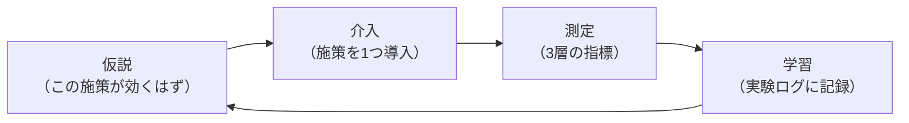

# ドキュメント施策の評価設計 v0.1

- 作成日: 2026-08-25
- 目的: 先行調査レポート（§1〜§9）で挙げた施策群が「本当に効いているか」を測定・評価する仕組みを設計する。
- 位置づけ: このプロジェクトの実験計画。施策を導入する**前に**この評価系を先に立ち上げる。

## 0. 「評価の仕組みが必要では」という直感は正しい

2つの根拠がある。第一に、ドキュメント品質は測定可能であり、測定する価値が実証されている。Google の [DORA 研究](https://dora.dev/capabilities/documentation-quality/)は、明確性・検索可能性・信頼性などの属性でドキュメント品質を測定し、**ドキュメント品質が高いチームでは他の技術プラクティスの効果が劇的に増幅される**ことを示した（例: トランクベース開発の改善効果が、文書品質が平均以下のチームでは36%に留まるのに対し、平均以上のチームでは1525%）。つまり「資料の質」は感覚論ではなく、成果に効く測定可能な変数として扱える。

第二に、AI の世界では **eval駆動開発（Eval-Driven Development）** が確立しつつある——プロンプトやシステムを変更するたびに固定の評価セットを流し、スコアの回帰で品質を守るやり方だ（[DeepEval の解説](https://deepeval.com/blog/eval-driven-development)、[OpenAI の評価ベストプラクティス](https://developers.openai.com/api/docs/guides/evaluation-best-practices)）。資料を「AI が消費する入力」と捉えるこのプロジェクトでは、**資料の変更にも同じ回帰テストの考え方が適用できる**。施策の効果測定と、資料の品質保証を、同じ1つのハーネスで実現できるのがポイント。

## 1. 評価の3層構造

測定は性質の異なる3層に分ける。上の層ほど安く・速く・頻繁に回り、下の層ほど「本当に知りたいこと」に近いが遅い。

**Layer 1: 静的メトリクス（自動・毎コミット）。** 資料リポジトリから機械的に数えられる値。**変更波及率**（1つの変更イベントで書き換わった資料数——疎結合[§2]の直接の指標。1に近いほど良い）、**churn**（資料ごとの月間修正回数——変更頻度低減[§1]の指標）、**出典カバレッジ**（技術的主張のうち一次情報リンク付きの割合——[§8]の指標）、**リンク健全性**（リンク切れ・text fragment 不一致の率）、**用語揺れ検出数**（グロッサリとの照合違反数）、**トークンサイズ**（資料セット全体と、1タスクで AI が読み込む量——[§3]の指標）、**未決の滞留**（Open Questions の件数・平均滞留日数・本文への散在数——[§6]の指標）。

**Layer 2: AI評価ハーネス（定期実行・このプロジェクトの中核）。** 資料を AI に渡して性能を測る、「資料のユニットテスト」。

- **ゴールデンQAセット**: 実際の業務で出た質問・議事録の決定事項から「質問と正答」のペアを20〜50問作る。AI に**資料だけ**を渡して回答させ、正答率と「回答の根拠が資料内に存在するか」を採点する。採点には RAG 評価で確立された指標——faithfulness（回答が資料に忠実か）、factual correctness（正答との一致）、context recall（必要情報が資料に存在するか）——がそのまま流用できる（[RAGAS メトリクスの解説](https://saulius.io/blog/ragas-rag-evaluation-metrics-llm-judge)）。**答えられない・間違える質問は、資料の欠落・曖昧・矛盾の検出器**になる。
- **タスク遂行テスト**: 小さな設計・実装タスクを資料だけ渡して AI に実行させ、成功可否・追加質問の数・誤りの種類を記録する。資料の実用性の直接測定。
- **矛盾注入テスト**: 意図的に矛盾を資料に仕込み、AI 矛盾チェッカー（§5・§9の施策）が何割検出できるかを測る。**検出器そのものの性能評価**であり、「AI が見逃した矛盾を私も見逃す」不安に対して「検出器は今どれくらい信頼できるか」という数値で答えられるようになる。
- **A/B 比較**: 同じ質問セット・同じモデル・同じプロンプトで、資料の旧版（v1）と改訂版（v2）だけを差し替えてスコア差を見る。これが「施策の効果」の最も直接的な測定。LLM ジャッジにはゆらぎがあるので、1回の数値でなく複数回実行して分布で判断する（[LLM 評価ガイド](https://www.evidentlyai.com/llm-guide/llm-evaluation)）。

**Layer 3: 実務アウトカム（遅行指標・記録ベース）。** 最終的に知りたいのはここ。**資料起因の手戻り件数**（矛盾・誤りが原因の手戻りを1行でいいからインシデントログに記録する）、**資料で答えられなかった質問数**（上長・同僚にした質問のうち「本来資料にあるべきだった」もの）、**理解時間**（新しい資料セットを読んで要点を説明できるまでの時間）。件数が少なく統計にはならないが、Layer 1・2 の指標が実務と乖離していないかの検算として機能する。

## 2. 問題意識と指標の対応表

| 問題意識（レポートの§） | 主な指標 | 層 |
|---|---|---|
| §1 変更頻度 | churn、揮発的事実の混入数 | L1 |
| §2 疎結合 | 変更波及率 | L1 |
| §3 フォーマット | トークンサイズ、QA正答率（同じ内容で形式だけ変えて比較） | L1+L2 |
| §5 理解の追いつき | タスク遂行テスト、理解時間 | L2+L3 |
| §6 未決/正典 | 未決の滞留、正典違反（議事録直参照）の数 | L1 |
| §8 根拠 | 出典カバレッジ、出典照合合格率 | L1+L2 |
| §9 矛盾検出 | 矛盾注入テストの検出率 | L2 |

## 3. 実験の回し方

**ベースライン先行の原則。** 施策を入れる前に、現状の資料で Layer 1・2 を一度測る。ベースラインなしで導入すると、効果は永遠に「あった気がする」で終わる。

**1回に1施策。** グロッサリと出典規約を同時に入れると、QA 正答率が上がってもどちらが効いたか分からない。導入順を決めて（推奨: グロッサリ → 出典規約 → 正典の階層 → フォーマット統一）、各段階でハーネスを回す。

**実験ログは追記型。** 1実験1ファイルで「仮説 / 介入 / 測定結果（前後） / 結論」を記録する（ADR と同じ思想。experiments/ フォルダに連番で置く）。失敗した施策の記録は成功と同じ価値がある——「効かなかった」が分かることがこの研究のアウトプットになる。

**注意点2つ。** 第一に **Goodhart の法則**: 指標が目標になった瞬間に指標は壊れる（出典カバレッジを上げるためだけの形式的リンクなど）。指標は成績表ではなく診断ツールとして使う。第二に **LLM ジャッジのゆらぎ**: 採点モデル・プロンプトを固定し、スコアは複数回の分布で見る。モデルを更新したらベースラインを取り直す。

## 4. 最小構成で始める（今日から可能な範囲）

完璧なハーネスを作ってから始める必要はない。最小構成は3点: (1) ゴールデンQA 20問（今の AWS 設計書の内容から作る）、(2) 静的カウント3つ（変更波及率・出典カバレッジ・トークンサイズ——最初は手数えでよい）、(3) 実験ログのテンプレート1枚。これだけで「グロッサリを入れたら QA 正答率と用語揺れがどう動いたか」を数字で語れるようになる。QA 評価の実行はスクリプト化する前に、まず Claude のセッションに「この資料だけを根拠に以下の質問に答えよ」と渡して採点する手動運用で十分成立する。

## 主要ソース

- [DORA: Documentation quality](https://dora.dev/capabilities/documentation-quality/) — ドキュメント品質の測定属性と、組織パフォーマンスへの増幅効果の実証
- [RAGAS メトリクス解説](https://saulius.io/blog/ragas-rag-evaluation-metrics-llm-judge) / [RAG 評価の実践ガイド](https://dataaspirant.com/blog/rag-evaluation/) — faithfulness / factual correctness / context recall の定義と計算
- [DeepEval: Eval-Driven Development](https://deepeval.com/blog/eval-driven-development) / [OpenAI: Evaluation best practices](https://developers.openai.com/api/docs/guides/evaluation-best-practices) / [Evidently: LLM evaluation guide](https://www.evidentlyai.com/llm-guide/llm-evaluation) — 評価セットによる回帰テストの運用
- [GetDX: Developer documentation の測定](https://getdx.com/blog/developer-documentation/) / [GitLab: Documentation testing](https://docs.gitlab.com/development/documentation/testing/) — 実務での文書メトリクスと CI 運用
