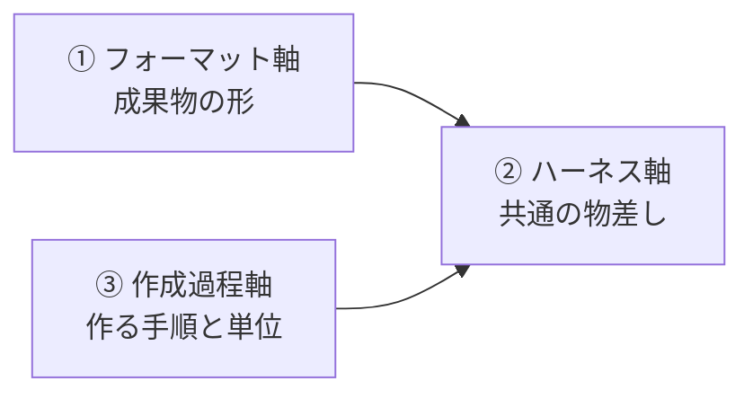

# 研究の三軸フレーム v0.1 — フォーマット / ハーネス / 作成過程

| 項目 | 内容 |
|---|---|
| 作成日 | 2026-08-26 |
| 位置づけ | 本研究の全体構造を3つの軸で再定式化する。発端はプロジェクトオーナーの問題意識——「資料の作成には、資料のフォーマット・AI のハーネス・資料の作成過程（Issue の区切り方 = 一回の作成の範囲）の三つが絡んでいる」。既存の ROADMAP と調査資料はこのうち2軸をカバー済みで、第3軸（作成過程）を本フレームで新たに研究対象に加える |

## 1. 3軸の定義と既存資産への対応

| 軸 | 問い | 既存資産 | 実体化される場所 |
|---|---|---|---|
| ① フォーマット軸 | 成果物はどんな形であるべきか | 先行調査 §1〜§4・§7・§8（research/2026-08-25_先行調査_AI駆動開発時代のドキュメント.md） | canon.md、conventions/、templates/ |
| ② ハーネス軸 | 良し悪しをどう測るか | 評価設計 v0.1（research/2026-08-25_評価設計_ドキュメント施策の効果測定.md） | harness/、experiments/ |
| ③ 作成過程軸 | どんな手順・単位で作るべきか | **新規**（部品は先行調査 §4・§5 に散在） | conventions/authoring-process.md、リポジトリの Issue 運用 |

3軸の関係: フォーマットは「成果物の形」、作成過程は「作る手順と単位」、ハーネスは「両者を判定する共通の物差し」。①と③の施策はどちらも②で測る。この構図から、ハーネスを先に立てる既存ロードマップの順序（M2 ベースライン先行）は三軸フレームでも変わらない。

## 2. 作成過程軸とは何か

**定義**: 資料作成タスクの区切り方の設計。具体的には (a) **粒度** — 1回の作成（1 Issue）で資料のどこからどこまでを書くか、(b) **順序** — どの文書・どの節から書くか（spec 先行か直接執筆か）、(c) **上限** — 1単位の大きさを何が制約するか。

**既存部品との接続**（部品はあるが、統合した設計・実証はない）:

- SDD のフェーズゲート（`Constitution → Specify → Clarify → Plan → Tasks → Implement → Analyze` の各フェーズに人間レビュー）は「順序」の既存解（[SDD in 2026](https://dev.to/krlz/spec-driven-development-in-2026-what-it-is-the-tooling-and-how-teams-actually-use-it-2fk2)、先行調査 §4）
- Comprehension Debt は「上限」の根拠——人間のレビュー容量を超える単位で生成すると理解負債が積み上がる（[Addy Osmani](https://addyosmani.com/blog/comprehension-debt/)、先行調査 §5）
- Diátaxis の「完全なテンプレートを最初に全部埋めようとするな。必要が生じた文書から書け」は「着手順」の既存解（[Diátaxis](https://diataxis.fr/)、先行調査 §4）
- topic-based authoring / LLM-friendly docs の「自己完結セクション」は「粒度の単位」の有力候補（[Fern のガイド](https://buildwithfern.com/post/how-to-write-llm-friendly-documentation)、先行調査 §3）

**研究ギャップ**: 「ドキュメント作成タスクの粒度・順序が成果物の品質（QA スコア・手戻り・作成時間）に与える影響」を統制比較した研究は、文献マップ（research/2026-08-25_文献マップ_関連学術論文.md）の探索範囲（約90本）では未発見。文献マップの研究ギャップ⑤として追記した。コード生成では粒度の議論（タスク分解、プロンプト具体性）が始まっているが、ドキュメント作成を対象にしたものは見当たらない。

## 3. 仮説（実験候補）

- **H1（粒度）**: 作成単位を「自己完結セクション（1責務）」に区切って書くと、文書全体の一気書きに比べて QA 正答率が上がり、手戻りが減る
- **H2（順序）**: spec（意図）を先に固定してから設計書を書くと、直接執筆より矛盾の混入が減る
- **H3（上限）**: 1単位の適正上限は人間のレビュー容量（一度に理解・承認できる量）で決まり、超えるとレビュー見逃し（理解負債）が増える

**実験の形**: 同一題材・同一モデル・同一フォーマット規約で、作成過程だけを変えた A/B 比較。測定は、ハーネス軸の既存指標から QA 正答率（評価設計 L2）と churn（L1）を流用し、**作成時間と作成中の手戻り数は周6 で新たに追加する**（評価設計 L3 の「資料起因の手戻り件数」は遅行指標であり、ここで測る作成中の手戻りとは定義を分ける）。ROADMAP.md の M3 周6 として追加した。物差しの大部分をフォーマット軸の実験と共有できるのが三軸フレームの実利。

## 4. ドッグフーディング（今日から始める観察）

ai-docs-lab 自身の作業を GitHub Issues で運用する。ルールは作成過程規約（conventions/authoring-process.md）に従う: **1 Issue = 1変更意図**（成果物ファイルが1つとは限らない）、**達成条件と対応範囲（やること / やらないこと）を Issue 本文に必須**（2026-09-05 改訂。当初は「1 Issue = 1成果物・達成条件必須」だったが、作成過程規約 v0.4 で粒度の単位が変更意図に改められ、対応範囲が必須欄に加わった）。どの粒度の Issue が手戻りなく完了し、どの Issue が分割・やり直しになったかを記録し、周6 の実験設計（H1〜H3 の水準の具体化）の観察データにする。これは「研究プロセス自体を成果物にする」原則（ROADMAP §0）の作成過程軸への適用でもある。
